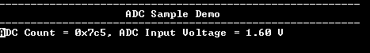

# ADC Sample

This example application shows how to sample an analog input using the ADC and displays the converted samples on a serial terminal.

## Description

In this application, DAC output is fed to an analog input for the ADC conversion. An analog input is converted by a software trigger and the converted value is displayed on the console.DAC output is changed by 0.1 V upon switch press.

| Board | DAC output range|
| ----- | --------------- |
| [PIC32CM LE00 Curiosity Pro]() | 0 V to 3.3 V |
|||

## Downloading and building the application

To download or clone this application from Github, go to the [top level of the repository](https://github.com/Microchip-MPLAB-Harmony/csp_apps_pic32cm_le00_ls00) and click

Path of the application within the repository is **apps/adc/adc_sample/firmware** .

To build the application, refer to the following table and open the project using its IDE.

| Project Name      | Description                                    |
| ----------------- | ---------------------------------------------- |
| pic32cm_le00_curiosity_pro.X | MPLABX project for [PIC32CM LE00 Curiosity Pro Evaluation Kit]() |
|||

## Setting up the hardware

The following table shows the target hardware for the application projects.

| Project Name| Board|
|:---------|:---------:|
| pic32cm_le00_curiosity_pro.X | [PIC32CM LE00 Curiosity Pro Evaluation Kit]()
|||

### Setting up [PIC32CM LE00 Curiosity Pro Evaluation Kit]()

- Analog input (AIN1) is fed from the DAC output
  - Analog input "AIN1" is mapped to Port Pin "PA03" that is routed to "Pin 4 of the EXT1 header"
  - DAC output "DAC" is mapped to Port Pin "PA02" that is routed to "Pin 3 of the EXT1 header"
  - Use a jumper wire to Connect "Pin 4 of the EXT1 header" to "Pin 3 of the EXT1 header"
- Connect the Debug USB port on the board to the computer using a micro USB cable

## Running the Application

1. Open the Terminal application (Ex.:Tera term) on the computer
2. Connect to the EDBG Virtual COM port and configure the serial settings as follows:
    - Baud : 115200
    - Data : 8 Bits
    - Parity : None
    - Stop : 1 Bit
    - Flow Control : None
3. Build and Program the application using its IDE
4. Press switch to change the DAC value
5. ADC input voltage changes by 0.1 V when the switch is pressed, from 0.0 V to 3.3 V
6. Refer to the table below for the switch details:

    | Board| Switch name |
    |:---------|:---------:|
    | [PIC32CM LE00 Curiosity Pro Evaluation Kit]()    | SW1|
    |||

7. Console displays the ADC count and the ADC input voltage in the console as shown below:

    
