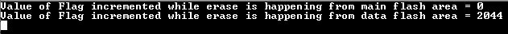

# NVMCTRL data flash

This example application demonstrates code execution from the main Flash memory while performing erase operation in data flash section.

## Description

The main Flash memory can not be read while it is being erased or written, the CPU is stalled during the entire operation. Some devices has the Flash region called data flash that supports read while write feature. The user could execute code from main Flash while the data flash region is being erased or written. This application demonstrates code execution from main Flash while the data flash section is being erased. A software counter is incremented while performing erase operation in data flash section and the counter value is reported in the console.

## Downloading and building the application

To download or clone this application from Github, go to the [top level of the repository](https://github.com/Microchip-MPLAB-Harmony/csp_apps_pic32cm_le00_ls00) and click

Path of the application within the repository is **apps/nvmctrl/nvmctrl_data_flash/firmware** .

To build the application, refer to the following table and open the project using its IDE.

| Project Name      | Description                                    |
| ----------------- | ---------------------------------------------- |
| pic32cm_le00_curiosity_pro.X | MPLABX project for [PIC32CM LE00 Curiosity Pro Evaluation Kit]() |
|||

## Setting up the hardware

The following table shows the target hardware for the application projects.

| Project Name| Board|
|:---------|:---------:|
| pic32cm_le00_curiosity_pro.X | [PIC32CM LE00 Curiosity Pro Evaluation Kit]()
|||

### Setting up [PIC32CM LE00 Curiosity Pro Evaluation Kit]()

- Connect the Debug USB port on the board to the computer using a micro USB cable

## Running the Application

1. Open the Terminal application (Ex.:Tera term) on the computer
2. Connect to the EDBG Virtual COM port and configure the serial settings as follows:
    - Baud : 115200
    - Data : 8 Bits
    - Parity : None
    - Stop : 1 Bit
    - Flow Control : None
3. Build and Program the application using its IDE
4. The LED blinks continuously on success

    The following table provides the LED name.

    | Board Name | LED Name |
    |------------| -------- |
    |[PIC32CM LE00 Curiosity Pro Evaluation Kit]() | LED1 |

5. Observe output message in console as follows:

    