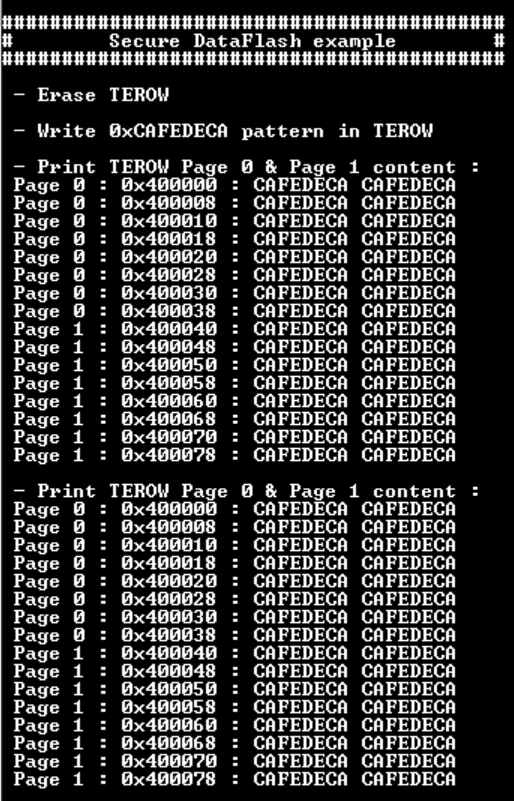

# NVMCTRL Data Flash with Silent Access and RTC Tamper Detection

This example application displays the Data Flash content on a console which is refreshed every seconds. The Silent Access and Tamper Erase security features of the Data Flash are enabled.

## Description

This application configures the RTC peripheral for tamper detection, the SERCOM 3 peripheral to display content on console through UART pins. The application enable Data Flash security features (Silent Access and Tamper Erase), erase and display Data Flash content, fill Data Flash and display its content on console. When a Tampere is detected, Non-Secure application is halted and Data Flash content is fully erased.

## Downloading and building the application

To clone or download this application from Github, go to the [main page of this repository](https://github.com/Microchip-MPLAB-Harmony/csp_apps_pic32cm_le_ls) and then click **Clone** button to clone this repository or download as zip file.
This content can also be downloaded using content manager by following these [instructions](https://github.com/Microchip-MPLAB-Harmony/contentmanager/wiki).

Path of the application within the repository is **apps/nvmctrl/nvmctrl_dataflash_SA_TE/firmware** .
||||

To build the application, refer to the following table and open the project using its IDE.

| Project Name      | Description                                    |
| ----------------- | ---------------------------------------------- |
| pic32cm_le00_curiosity_pro.X | MPLABX project for [PIC32CM LE00 Curiosity Pro Evaluation Kit]() |
|||

## Setting up the hardware

The following table shows the target hardware for the application projects.

| Project Name| Board|
|:---------|:---------:|
| pic32cm_le00_curiosity_pro.X | [PIC32CM LE00 Curiosity Pro Evaluation Kit]()
|||

### Setting up [PIC32CM LE00 Curiosity Pro Evaluation Kit]()

- Connect the Debug USB port on the board to the computer using a micro USB cable
- Short PA08 pin (EXT3, PIN 3) to Vcc

## Running the Application

1. Open the Terminal application (Ex.:Tera term) on the computer
2. Connect to the EDBG Virtual COM port and configure the serial settings as follows:
    - Baud : 115200
    - Data : 8 Bits
    - Parity : None
    - Stop : 1 Bit
    - Flow Control : None
3. Open the project group in the MPLAB X IDE and set the non-secure project as main project
4. Build and program the application
5. The console should display the following Secure Data Flash content:

6. Tied down the PA08 pin with a jumper (Remove short from Vcc and connect it to GND to create a falling edge)
7. The following Secure Data Flash content should be observed on console, meaning the Secure Data Flash Tamper Erase Row 0 was performed because of RTC Tamper Detection:

