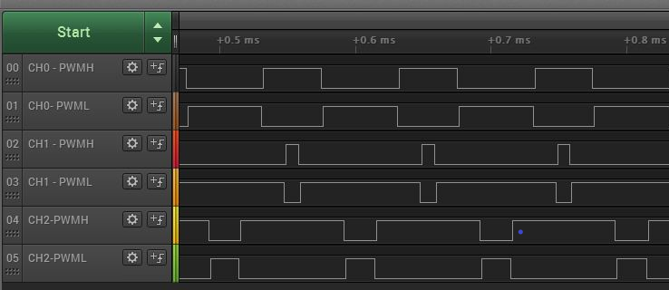

# TCC PWM generation

This example application shows how to use the TCC to generate a 2 or 3 phase PWM signals for motor control with dead time.

## Description

TCC module is configured to generate synchronous 2 or 3 phase PWM signals with dead time. The duty cycle of the PWM signals is updated in the period interrupt handler.

## Downloading and building the application

To clone or download this application from Github, go to the [main page of this repository](https://github.com/Microchip-MPLAB-Harmony/csp_apps_pic32cm_le_ls) and then click **Clone** button to clone this repository or download as zip file.
This content can also be downloaded using content manager by following these [instructions](https://github.com/Microchip-MPLAB-Harmony/contentmanager/wiki).

Path of the application within the repository is **apps/tcc/tcc_synchronous_pwm_channels/firmware** .

To build the application, refer to the following table and open the project using its IDE.

| Project Name      | Description                                    |
| ----------------- | ---------------------------------------------- |
| pic32cm_le00_curiosity_pro.X  | MPLABX project for [PIC32CM LE00 Curiosity Pro Evaluation Kit](https://www.microchip.com/en-us/development-tool/EV80P12A) |
|||

## Setting up the hardware

The following table shows the target hardware for the application projects.

| Project Name| Board|
|:---------|:---------:|
| pic32cm_le00_curiosity_pro.X | [PIC32CM LE00 Curiosity Pro Evaluation Kit](https://www.microchip.com/en-us/development-tool/EV80P12A)
|||

### Setting up [PIC32CM LE00 Curiosity Pro Evaluation Kit](https://www.microchip.com/en-us/development-tool/EV80P12A)

- Connect the Debug USB port on the board to the computer using a micro USB cable

## Running the Application

1. Build and Program the application using its IDE
2. Observe the high-side and low-side PWM waveforms on oscilloscope
3. Observe the dead time between the high side and the low side
4. Observe the pwm frequency to be 10 KHz

[PIC32CM LE00 Curiosity Pro Evaluation Kit](https://www.microchip.com/en-us/development-tool/EV80P12A) pin details:

|Signal Name| Pad   | Pin |
|-----------|-------|-----|
| ch0-PWMH  | PA08  | Pin 3 of EXT3 connector |
| ch0-PWML  | PB16  | Pin 7 of EXT2 connector  |
| ch1-PWMH  | PA09  | Pin 4 of EXT3 connector |
| ch1-PWML  | PB17  | Pin 8 of EXT2 connector |
| ch2-PWMH  | PA10  | Pin 5 of EXT1 connector |
| ch2-PWML  | PA12  | Pin 14 of EXT3 connector |
||||

  
