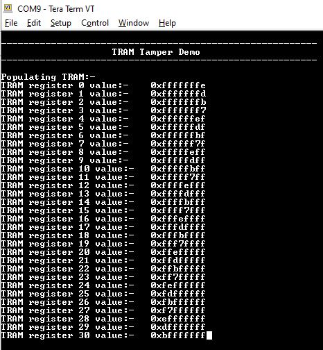
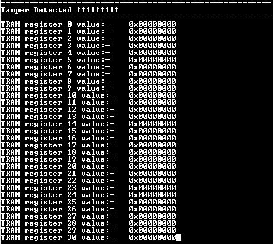

# TRAM erase on tamper detect

This example application shows how to configure and use tamper detect feature of RTC and TrustRam.

## Description

This example application shows how to setup and configure tamper detection using the RTC Peripheral Library. The application populates TrustRam with random data and then waits for tamper detection to happen. On Tamper detection, application displays the tamper detected and read the content of the TrustRam. The example demonstrates auto erase feature of the TrustRam when tamper is detected.

## Downloading and building the application

To download or clone this application from Github, go to the [top level of the repository](https://github.com/Microchip-MPLAB-Harmony/csp_apps_pic32cm_le00_ls00) and click

Path of the application within the repository is **apps/tram/tram_tamper_erase/firmware** .

To build the application, refer to the following table and open the project using its IDE.

| Project Name      | Description                                    |
| ----------------- | ---------------------------------------------- |
| pic32cm_le00_curiosity_pro.X | MPLABX project for [PIC32CM LE00 Curiosity Pro Evaluation Kit]() |
|||

## Setting up the hardware

The following table shows the target hardware for the application projects.

| Project Name| Board|
|:---------|:---------:|
| pic32cm_le00_curiosity_pro.X | [PIC32CM LE00 Curiosity Pro Evaluation Kit]()
|||

### Setting up [PIC32CM LE00 Curiosity Pro Evaluation Kit]()

- Connect the Debug USB port on the board to the computer using a micro USB cable

## Running the Application

1. Open the Terminal application (Ex.:Tera term) on the computer
2. Connect to the EDBG Virtual COM port and configure the serial settings as follows:
    - Baud : 115200
    - Data : 8 Bits
    - Parity : None
    - Stop : 1 Bit
    - Flow Control : None
3. Build and Program the application using its IDE
4. Console will print the value contained in the TRAM (Observe that the TRAM contains non zero values)

    

5. To emulate tampering, create a falling edge on the RTC input pin
    - Short RTC Input pin to Vcc
    - Remove the short to create a falling edge

    | Board| RTC input| Vcc|
    |:---------|:---------:|:---------:|
    | [PIC32CM LE00 Curiosity Pro Evaluation Kit]() | RTC Input 0 (EXT3, PIN 3) | EXT3, pin 20|
    ||||

6. Console will output the current value of TRAM (Observe that the TRAM values now read zero indicating a erasure of the TRAM content)

    