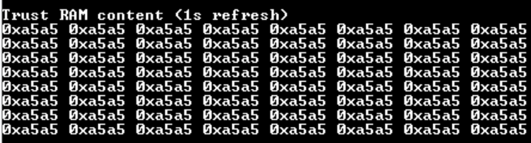
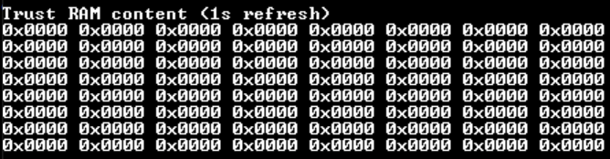

# TRAM with Security Features demonstration

This example application displays the TrustRAM content on a console which is refreshed every seconds. This example allows to experiment static and dynamic tamper detections coupled with a TrustRAM full erase.

## Description

The application configures the TrustRAM security features (Silent Access - Data Scrambling - Tamper Erase) and configures the SERCOM3 peripheral to display content on console through UART pins. The application the fill TrustRAM with pattern and display its content every second. When a Tamper is detected, application is halted and TrustRAM contetn is fully erased.

## Downloading and building the application

To clone or download this application from Github, go to the [main page of this repository](https://github.com/Microchip-MPLAB-Harmony/csp_apps_pic32cm_le_ls) and then click **Clone** button to clone this repository or download as zip file.
This content can also be downloaded using content manager by following these [instructions](https://github.com/Microchip-MPLAB-Harmony/contentmanager/wiki).

Path of the application within the repository is **apps/tram/tram_with_security_features/firmware**.
||||

To build the application, refer to the following table and open the project using its IDE.

| Project Name      | Description                                    |
| ----------------- | ---------------------------------------------- |
| pic32cm_le00_curiosity_pro.X | MPLABX project for [PIC32CM LE00 Curiosity Pro Evaluation Kit](https://www.microchip.com/en-us/development-tool/EV80P12A) |
|||

## Setting up the hardware

The following table shows the target hardware for the application projects.

| Project Name| Board|
|:---------|:---------:|
| pic32cm_le00_curiosity_pro.X | [PIC32CM LE00 Curiosity Pro Evaluation Kit](https://www.microchip.com/en-us/development-tool/EV80P12A)
|||

### Setting up [PIC32CM LE00 Curiosity Pro Evaluation Kit](https://www.microchip.com/en-us/development-tool/EV80P12A)

- Connect the Debug USB port on the board to the computer using a micro USB cable
- Short PA08 pin (EXT3, PIN 3) to Vcc

## Running the Application

1. Open the Terminal application (Ex.:Tera term) on the computer
2. Connect to the EDBG Virtual COM port and configure the serial settings as follows:
    - Baud : 115200
    - Data : 8 Bits
    - Parity : None
    - Stop : 1 Bit
    - Flow Control : None
3. Open the project in the MPLAB X IDE
4. Build and program the application
5. The console should display the following TrustRAM content:

6. Tied down the PA08 pin with a jumper (Remove short from Vcc and connect it to GND to create a falling edge)
7. The following TrustRAM content should be observed on console, meaning the TrustRAM Full Erase was performed because of Tamper Erase Detection:

