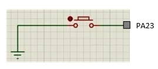
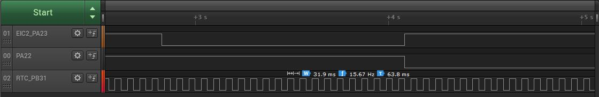

# TrustZone EIC pin toggle

This example application demonstrates handling of external pin interrupt in secure and non-secure project.

## Description

This demonstrates TrustZone feature and uses two projects viz., Secure and Non-Secure Project that work together on the same
MCU and offering security isolation between the Trusted and the Non-trusted resources in the device.

- Secure project uses an EIC pin to generate interrupt on rising edge and toggles the LED0
- Non-secure project uses an EIC pin to generate interrupt on rising edge and toggle an GPIO pin and LED1
- Non-secure project also uses RTC to generate periodic event to toggle a GPIO pin

## Components Used

- **EIC** - Configured as Mix-Secure Peripheral for Secure EIC and Non-secure EIC interrupts
- **Event System** - Configured as Mix-Secure Peripheral for the Secure and Non-secure events
- **RTC** - Configured as Non-secure mode
- **LED0** - Configured as Secure mode
- **LED1** - Configured as Non-secure mode
- **Two NON_SECURE_PIN** - Configured as Non-secure mode

## Downloading and building the application

To clone or download this application from Github, go to the [main page of this repository](https://github.com/Microchip-MPLAB-Harmony/csp_apps_pic32cm_le_ls) and then click **Clone** button to clone this repository or download as zip file.
This content can also be downloaded using content manager by following these [instructions](https://github.com/Microchip-MPLAB-Harmony/contentmanager/wiki).

Path of the application within the repository is as shown below:

| Type        | Path                         |
|:-----------:|:----------------------------:|
| Project group | apps/trustZone/eic/eic_pin_toggle |
|Secure Project|  apps/trustZone/eic/eic_pin_toggle/Secure/firmware |
|Non-Secure Project|  apps/trustZone/eic/eic_pin_toggle/NonSecure/firmware |
||||

To build the application, refer to the following table and open the project using its IDE.

| Project Name      | Description                                    |
| :-----------------: | :----------------------------------------------: |
| pic32cm_ls00_cpro_Secure.X   pic32cm_ls00_cpro_NonSecure.X | Secure and Non-secure MPLABX project for [PIC32CM LS00 Curiosity Pro Evaluation Kit]() |
|||

## Setting up the hardware

The following table shows the target hardware for the application projects.

| Project Name| Board|
|:---------|:---------:|
| pic32cm_ls00_cpro_Secure.X   pic32cm_ls00_cpro_NonSecure.X | [PIC32CM LS00 Curiosity Pro Evaluation Kit]() |
|||

### Setting up [PIC32CM LS00 Curiosity Pro Evaluation Kit]()

- Connect the Debug USB port on the board to the computer using a micro USB cable
- Connect an oscilloscope/Logic analyzer to monitor the PORT pin PA22 (Pin #14 on EXT1)
- Connect an oscilloscope/Logic analyzer to monitor the PORT pin PB31 (Pin #12 on EXT1)
- Tie a pushbutton switch to PA23 (Pin #13 on EXT1) to drive the line LOW on switch press and also connect the same to the oscilloscope/logic analyzer

  

## Running the Application

1. Open the project group in the MPLAB X IDE and set the non-secure project as main project
2. Build and program the application
3. Observe the output for [PIC32CM LS00 Curiosity Pro Evaluation Kit]() as follows:
    - LED0(Green) is toggled on Switch (SW0) press using EIC interrupt in secure project
    - LED1(Red) is toggled on Switch (SW1) press using EIC interrupt in non-secure project
    - Pin PA22 is toggled on Switch (connected to PA23) press using EIC interrupt in non-secure project
    - Periodic RTC event (every ~32ms) toggles PB31 pin in non-secure project

    