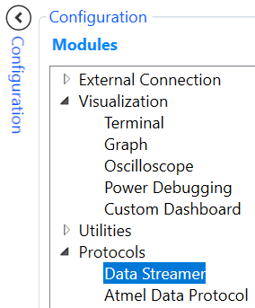
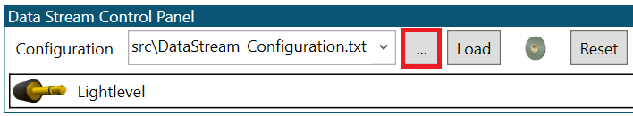
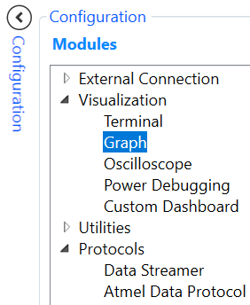
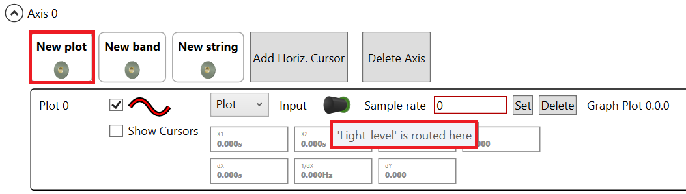
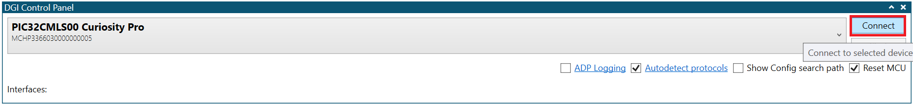
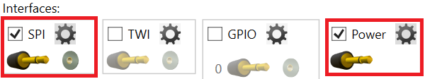
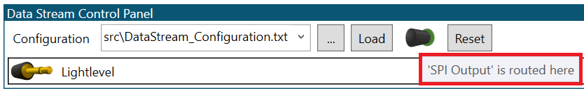
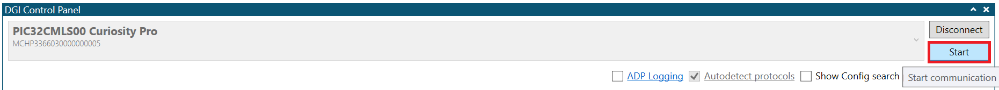
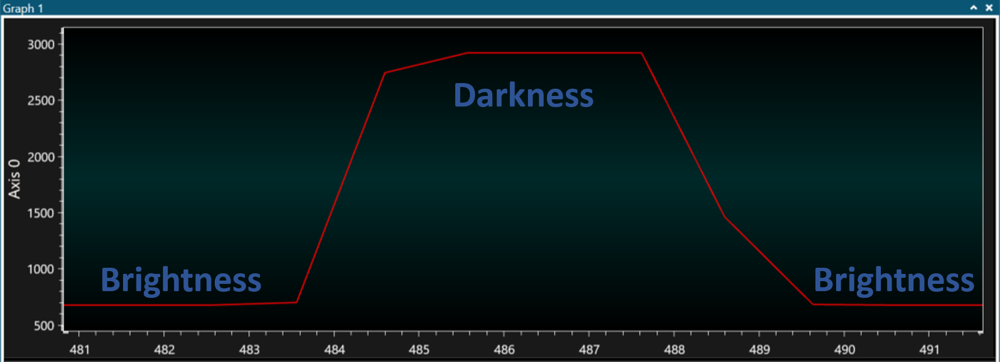
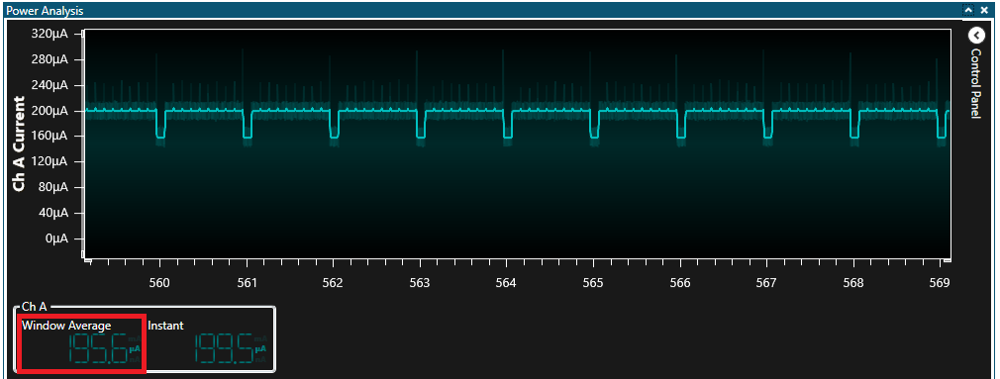

# Low-Power Features

This example highlights the power consumption for each sleep mode based on the same application integration.

## Description

This example application configures RTC to generate an interrupt or event (regarding sleep mode and configuration) to start an ADC conversion from light sensor value every 1 ms. The DMAC move the converted value from ADC Result to internal SRAM and after 10 transfers, DMA generates an interrupt to wake-up core and process data through DGI SPI pins. Application initial sleep mode state is IDLE mode. Pressing the SW0 button allows to go from one sleep mode to another.

Below is the low-power configuration for this application:
- Voltage Regulator is a Buck Converter
- Low Power Efficiency Mode is enabled
- Performance Level 2 (PL2) Mode is selected
- Power Domain Switchable (PDSW) is always ACTIVE

## Downloading and building the application

To clone or download this application from Github, go to the [main page of this repository](https://github.com/Microchip-MPLAB-Harmony/csp_apps_pic32cm_le_ls) and then click **Clone** button to clone this repository or download as zip file.
This content can also be downloaded using content manager by following these [instructions](https://github.com/Microchip-MPLAB-Harmony/contentmanager/wiki).

Path of the application within the repository is as shown below:

| Type        | Path                         |
|:-----------:|:----------------------------:|
| Project group | apps/trustZone/low_power_features_ls00 |
|Secure Project|  apps/trustZone/low_power_features_ls00/Secure/firmware |
|Non-Secure Project|  apps/trustZone/low_power_features_ls00/NonSecure/firmware |
||||

To build the application, refer to the following table and open the project using its IDE.

| Project Name      | Description                                    |
| ----------------- | ---------------------------------------------- |
| pic32cm_ls00_cpro.X   pic32cm_ls00_cpro_NonSecure.X | Secure and Non-Secure MPLABX projects for MPLABX project for [PIC32CM LS00 Curiosity Pro Evaluation Kit]() |
|||

## Setting up the hardware

The following table shows the target hardware for the application projects.

| Project Name| Board|
|:---------|:---------:|
| pic32cm_ls00_cpro_Secure.X   pic32cm_ls00_cpro_NonSecure.X | [PIC32CM LS00 Curiosity Pro Evaluation Kit]() |
| I/O1 Xplained Pro Extension Kit | [I/O1 Xplained Pro Extension Kit](https://www.microchip.com/DevelopmentTools/ProductDetails/ATIO1-XPRO) |
|||

### Setting up [PIC32CM LS00 Curiosity Pro Evaluation Kit]()

- Plug the I/O1 Xplained Pro Extension Kit to the EXT1 header on the board
- Connect the Debug USB port on the board to the computer using a micro USB cable

## Running the Application

1. Build and Program the application using its IDE
2. Open and Configure the [Microchip's Atmel Data Visualizer](https://gallery.microchip.com/packages/AtmelDataVisualizerInstaller-Standalone/)
	- Open a Data Streamer in Configuration > Protocols
	
	
	
	- Configure and Load the Data Streamer with the DataStream_Configuration text file available in NonSecure > firmware > src
	
	
	
	- Open a Graph in Configuration > Visualization
	
	
	
	- Drag & Drop the LightLevel icon to Graph window as a New plot
	
	
	
	- Connect the board with DGI Control Panel
	
	
	
	- Select SPI & Power intefaces
	
	
	
	- Drag & Drop the SPI icon to Data Stream Control Panel
	
	
	
	- Start the communication with the board
	
	

3. Power consumption and SPI Output should appear on the screen

	
	
	
	
4. Push SW0 button to go from one sleep mode to another (IDLE, STANDBY with IRQ, Static SleepWalking, OFF). Push RESET button when the device is in OFF mode to restart code example at initial sleep state (IDLE)
