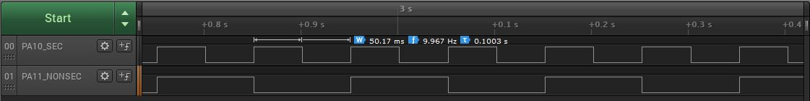

# TrustZone Systick periodic timeout

This example application shows how to use the SysTick to generate periodic interrupts on both Secure and Non-secure modes.

## Description

This demonstrates TrustZone feature and uses two projects viz., Secure and Non-Secure Project that work together on the same MCU and offering security isolation between the Trusted and the Non-trusted resources in the device.

- Secure project uses secure SysTick timer to generate periodic interrupt every 50ms to toggle a GPIO pin and an LED0
- Non-secure project uses non-secure SysTick timer to generate periodic interrupt every 100ms to toggle a GPIO pin and an LED1

## Components Used

- **Systick** - Secure and non-secure systicks
- **LED0** - Configured as secure mode
- **LED1** - Configured as non-secure mode
- **SECURE_PIN and NON_SECURE_PIN** - Configured as secure and non-secure mode respectively

## Downloading and building the application

To clone or download this application from Github, go to the [main page of this repository](https://github.com/Microchip-MPLAB-Harmony/csp_apps_pic32cm_le_ls) and then click **Clone** button to clone this repository or download as zip file.
This content can also be downloaded using content manager by following these [instructions](https://github.com/Microchip-MPLAB-Harmony/contentmanager/wiki).

Path of the application within the repository is as shown below:

| Type        | Path                         |
|:-----------:|:----------------------------:|
| Project group | apps/trustZone/systick/systick_periodic_timeout |
|Secure Project|  apps/trustZone/systick/systick_periodic_timeout/Secure/firmware |
|Non-Secure Project|  apps/trustZone/systick/systick_periodic_timeout/NonSecure/firmware |
||||

To build the application, refer to the following table and open the project using its IDE.

| Project Name      | Description                                    |
| :-----------------: | :----------------------------------------------: |
| pic32cm_ls00_cpro_Secure.X   pic32cm_ls00_cpro_NonSecure.X | Secure and Non-secure MPLABX project for [PIC32CM LS00 Curiosity Pro Evaluation Kit]() |
|||

## Setting up the hardware

The following table shows the target hardware for the application projects.

| Project Name| Board|
|:---------|:---------:|
| pic32cm_ls00_cpro_Secure.X   pic32cm_ls00_cpro_NonSecure.X | [PIC32CM LS00 Curiosity Pro Evaluation Kit]() |
|||

### Setting up [PIC32CM LS00 Curiosity Pro Evaluation Kit]()

- Connect the Debug USB port on the board to the computer using a micro USB cable
- Connect an oscilloscope/Logic analyzer to monitor the PORT pin PA10 (Pin #5 on EXT1)
- Connect an oscilloscope/Logic analyzer to monitor the PORT pin PA11 (Pin #6 on EXT1)

## Running the Application

1. Open the project group in the MPLAB X IDE and set the non-secure project as main project
2. Build and program the application
3. Observe the output for [PIC32CM LS00 Curiosity Pro Evaluation Kit]() as follows:
    - LED0(Green) and PA10 (Secure pin) is toggled every ~50ms in secure project.
    - LED1(Red) and PA11 (Non-secure pin) is toggled every ~100ms in non-secure project

    